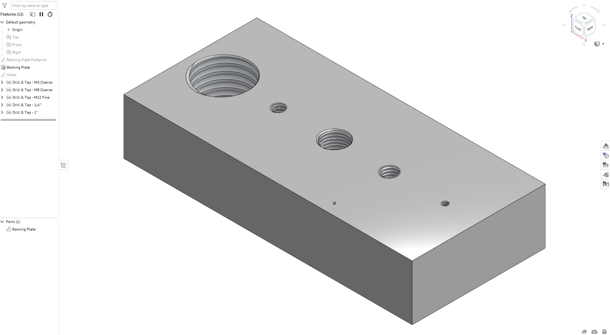
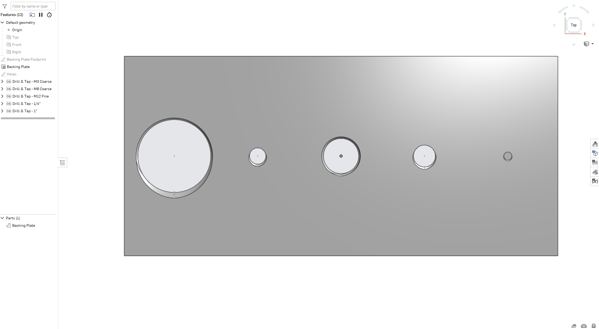
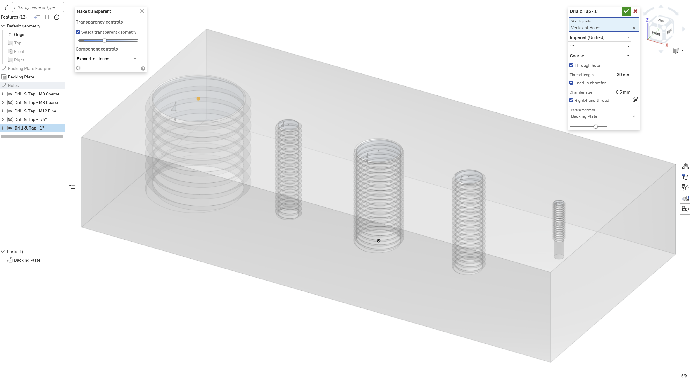
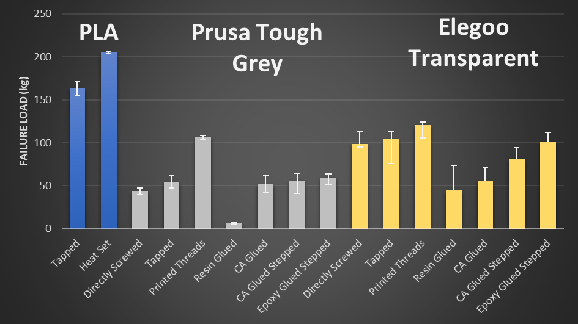

# Drill & Tap

A single Onshape FeatureScript that takes a sketch point and produces a real, helical, tapped hole on the target part in one operation. It drills the bore at the correct tap drill diameter for whichever thread you pick and then sweeps a 60 degree ISO V profile along a helix at the major diameter to cut the actual thread geometry, all from a single feature dialog. The size lookup covers ISO metric M3 through M24 in coarse and fine pitches, Unified UNC and UNF from #4 up to one inch, and a custom mode for anything outside those tables. Through hole and an entry lead in chamfer are both optional.

## What it looks like

A short worked example: a backing plate with five tapped holes (M3 coarse, M8 coarse, M12 fine, 1/4-20 UNC, and 1 inch UNC), each one generated from a sketch point as a single Drill & Tap feature in the tree.

## Why this exists

The existing thread FeatureScripts in the Onshape ecosystem are all good at what they do, but they share a workflow assumption that did not fit what I was trying to do. Each one takes a cylindrical hole or shaft that you have already modelled and adds thread geometry onto that existing surface.

[**Plastic Thread**](https://cad.onshape.com/documents/7a5d17f7ab4323f51774364f/v/d61030981e0fe5a69074e0e1/e/a7526dd34d322ef74f6f0e11) is tuned for 3D printable threads, with a slightly relaxed profile and clearances chosen so the threads come off the build plate cleanly and a real screw can actually be driven into them. You apply it to an existing hole or shaft and it lays the printable thread geometry onto that surface.

[**ThreadLab**](https://cad.onshape.com/documents/5c0528b62c1fbb13a2a0e739/v/0bb9d00523f327052c0a2e24/e/7cbb452d4d5e963a034ce616) is the most full featured of the three. It handles both cosmetic and real modelled threads, in metric and imperial, internal and external, and it carries the thread callout through into drawings the way the built in Hole feature does. You point it at a cylindrical face and pick the size.

[**Thread Creator**](https://cad.onshape.com/documents/6b640a407d78066bd5e41c7a/v/21ef017a4e386179c3be31f3/e/c953720c264ce001f1a82dc1) is the most general purpose of the three and probably the one most people install first. It adds standard metric or inch threads to a cylindrical face you select, in either cosmetic or modelled form.

All three do their job, but the workflow they share is the same: you drill the cylindrical hole first as one feature, and then you run the thread FeatureScript on the wall of that hole as a second feature. You also have to keep going back to a tap drill chart to make sure each hole's drilled diameter actually matches the minor diameter for the thread you are about to cut into it. Drill & Tap collapses both steps into one with the thread size as the source of truth, so picking M6 coarse drills the bore at 5.0 mm automatically, picking 1/4-20 drills at the right inch fraction, and the helical thread is cut in the same operation.

## Why real helical geometry instead of cosmetic threads

Onshape's built in Hole feature applies cosmetic threads by default, which are visual shading on the model plus a thread callout that shows up correctly in drawings. For most production engineering work that is the right answer, because the thread callout on the drawing is the actual specification, and adding the helical geometry to the model just makes the file heavier without changing what gets manufactured. So this FeatureScript is not arguing against cosmetic threads in general, it is filling a different need.

The need is this. Before I send a part to a machine shop I resin print it first, because the resin print is the closest prototype I can have before committing to machining and it lets me make sure everything actually goes together the way I expect. Resin printing works well for this because the dimensional shrinkage is small enough and consistent enough that a 6 mm hole in CAD comes out very close to a 6 mm hole on the build plate, which means the print I am physically checking is essentially the part I am about to order from the shop.

FDM printing would also let me hold a part in my hand, but it forces a compromise I would rather not make. FDM shrinks substantially more than resin, and the shrinkage varies with the filament material, the part size, the wall thickness, the cooling profile, and the orientation, so a 6 mm hole in CAD is not going to come out as a 6 mm hole on the build plate. To get a usable test print I would have to oversize the holes inside the CAD model, which means adding extra features in the part studio just for the printed version of the part, which then pollutes the design history with geometry that has no place in the part I am sending to be machined. Resin lets me skip that particular detour because the dimensional match between the CAD model and the print is close enough that I do not need a separately oversized version of the part just to get a useful prototype.

That is where the helical thread geometry becomes necessary. If I want to physically confirm that an M6 screw threads in cleanly, or that two threaded parts engage to the correct depth, or that the lead in chamfer is generous enough to actually start the screw, a cosmetic thread is useless because the printed part has no real threads on it. The print just has a smooth cylindrical hole at whatever diameter the cosmetic thread sits on, and a real screw will not bite into smooth resin. With real helical geometry in the CAD model the print comes out with real threads, I can put a real screw or stud into it, and the tolerance check actually verifies what I came to verify.

## How printed threads compare to the other options

There are several ways to handle threads in resin printed parts, and Stefan from CNC Kitchen [tested most of them in a careful article and video](https://www.cnckitchen.com/blog/how-to-use-threaded-inserts-in-resin-3d-prints), including hand tapping the resin, heat set inserts, directly screwing into the printed hole, a few glue assisted variants, and modelling and printing the threads directly in CAD. His failure load comparison across PLA, Prusa Tough Grey, and Elegoo Transparent shows that printed threads come out as the strongest option in both resin materials, and the result holds even though printed threads are also the simplest method to execute, since they need no post processing beyond the print itself.

So the workflow this FeatureScript supports is the prototyping side: design the part in Onshape with the tapped holes modelled as real helical geometry, and resin print it to verify the fit and that everything goes together the way you expect. When it comes time to actually machine the part, the convention is still to model the hole at the tap drill diameter and put the thread callout on the drawing, since the shop's tap cuts the thread itself rather than following the helical geometry in the model.

## Using it

1. In your Onshape document create a new Feature Studio tab, paste the contents of `DrillAndTap.fs`, and commit.
2. In a Part Studio sketch one or more points where you want the tapped holes to go.
3. From the toolbar open Custom features, pick Drill & Tap, and fill in the dialog: sketch points, thread standard, diameter, pitch series, hole depth (or through hole), thread length, optional lead in chamfer, and the target part.

The drill direction is taken from the sketch's host plane and auto oriented toward the target body, so the bore always heads into the material without needing a separate direction selector. The Flip direction arrow is there for the cases where you want to override the default.

## Known limitations

Helical sweeps are computationally heavier than cosmetic threads, so a long M3 thread can take a noticeable second or two to regenerate, and very fine pitches on long holes add up. The thread profile is a simple ISO 60 degree V without crest or root truncation, which is fine for resin prints and visualisation but is a small simplification compared to the exact ISO 68-1 profile. Standards covered are metric ISO and Unified inch only, so trapezoidal, buttress, NPT, and other thread profiles are out of scope here.

## Contributing

If something here could be done better, or you spot a bug, please open an issue or a pull request. The whole feature lives in one .fs file so most changes stay small and self contained.
